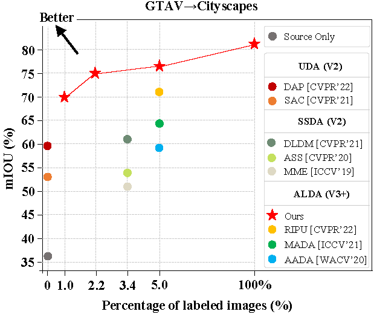
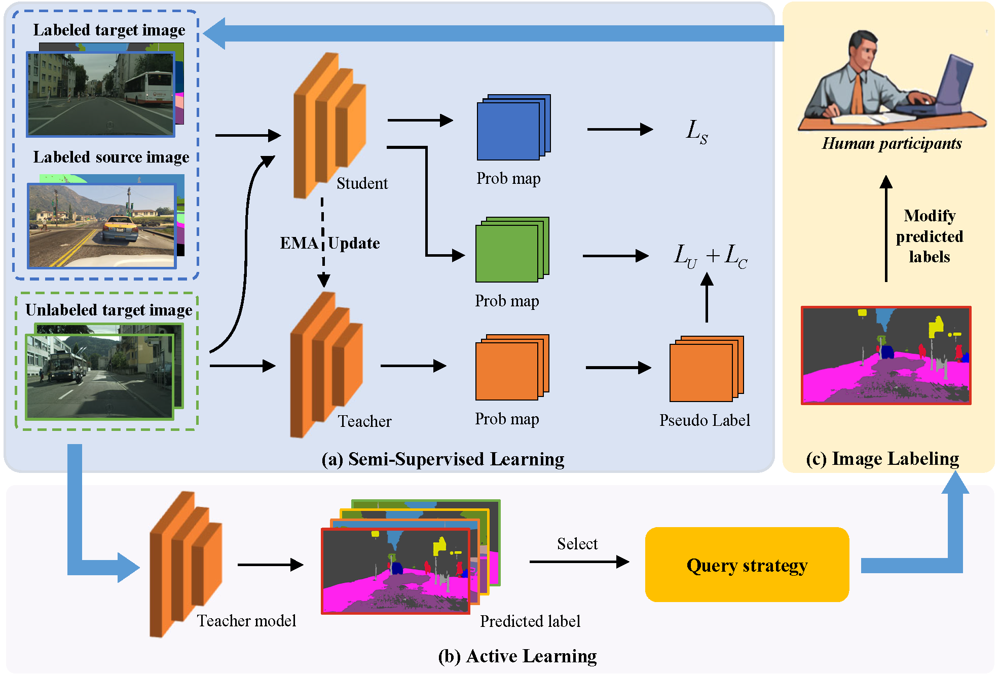

 ---

<div align="center"> 

# Iterative Loop Method Combining Active  and  <br>Semi-Supervised Learning for Domain <br> Adaptive Semantic Segmentation
by [Licong Guan](https://licongguan.github.io/), Xue Yuan

[](https://arxiv.org/abs/2301.13361)

</div>

<!-- <div align="center"> </div> -->

[](https://paperswithcode.com/sota/domain-adaptation-on-gta5-to-cityscapes?p=iterative-loop-learning-combining-self)

[](https://paperswithcode.com/sota/domain-adaptation-on-synthia-to-cityscapes?p=iterative-loop-learning-combining-self)

This repository provides the official code for the paper [Iterative Loop Method Combining Active and  Semi-Supervised Learning for Domain  Adaptive Semantic Segmentation](https://arxiv.org/abs/2301.13361).


> **Abstract** 
> Semantic segmentation is an important technique for environment perception in intelligent transportation systems.
>With the rapid development of convolutional neural networks (CNNs), road scene analysis can usually achieve satisfactory results in the source domain. However, guaranteeing good generalization to different target domain scenarios remains a significant challenge. 
>Recently, semi-supervised learning and active learning have been proposed to alleviate this problem. Semi-supervised learning can improve model accuracy with massive unlabeled data, but some pseudo labels containing noise would
be generated with limited or imbalanced training data. 
>And there will be suboptimal models if human guidance is absent. Active learning can select more effective data to intervene,while the model accuracy can not be improved because the massive unlabeled data are not used. 
>And the probability of querying sub-optimal samples will increase when the domain
difference is too large, increasing annotation cost. This paper proposes an iterative loop method combining active and semi-supervised learning for domain adaptive semantic segmentation.
>The method first uses semi-supervised to learn massive unlabeled data to improve model accuracy and provide more accurate selection models for active learning. Secondly, combined with the predictive uncertainty sample selection strategy of active learning, manual intervention is used to correct the pseudo-labels.
>Finally, flexible iterative loops achieve the best performance with minimal labeling cost.
>Extensive experiments show that our method establishes state-of-the-art performance on tasks of GTAV→Cityscapes, SYNTHIA→Cityscapes, improving by 4.9% mIoU and 5.2% mIoU, compared to the previous best method, respectively. 



<!--  -->

For more information on ILM-ASSL, please check our **[[Paper](https://arxiv.org/pdf/2301.13361.pdf)]**.

## Usage

### Prerequisites
- Python 3.6.9
- Pytorch 1.8.1
- torchvision 0.9.1

Step-by-step installation

```bash
git clone https://github.com/licongguan/ILM-ASSL.git && cd ILM-ASSL
conda create -n ILM-ASSL python=3.6.9
conda activate ILM-ASSL
pip install -r requirements.txt
pip install torch==1.8.1+cu102 torchvision==0.9.1+cu102 -f https://download.pytorch.org/whl/torch_stable.html
```

### Data Preparation

- Download [The Cityscapes Dataset](https://www.cityscapes-dataset.com/), [The GTAV Dataset](https://download.visinf.tu-darmstadt.de/data/from_games/), and [The SYNTHIA Dataset](https://synthia-dataset.net/)

**First, the data folder should be structured as follows:**

```
├── datasets/
│   ├── cityscapes/     
|   |   ├── gtFine/
|   |   ├── leftImg8bit/
│   ├── gtav/
|   |   ├── images/
|   |   ├── labels/
│   └──	synthia/
|   |   ├── RGB/
|   |   ├── LABELS/
```

**Second, generate ```_labelTrainIds.png``` for the cityscapes dataset:**

```bash
pip install cityscpaesscripts
pip install cityscpaesscripts[gui]
export CITYSCAPES_DATASET='/path_to_cityscapes'
csCreateTrainIdLabelImgs
```

**Final, rename the gtav and synthia files for  by running:**

```bash
python ILM-ASSL/datasets/rename.py
```

### Prepare Pretrained Backbone

Before training, please download ResNet101 pretrained on ImageNet-1K from one of the following:
  - [Google Drive](https://drive.google.com/file/d/1fkOA3WSM4FjqBw3EtQIaI5FgEtPMAky9/view?usp=share_link)
  - [Baidu Drive](https://pan.baidu.com/s/1GuXici8BzOfb5j3dfPttvg) Fetch Code: 0305

After that, modify ```model_urls``` in ```ILM-ASSL/models/resnet.py``` to ```</path/to/resnet101.pth>```


###  Model Zoo
#### GTAV to Cityscapes

We have put our model checkpoints here [[Google Drive](https://drive.google.com/drive/folders/1M674BpVWY7laWAdDkoHvVRh-36-zO1nM?usp=share_link)] [[百度网盘](https://pan.baidu.com/s/1a9d4SLVfQJE6p6Z8Cmhz0Q)] (提取码`0305`).

| Method                      | Net | budget | mIoU | Chekpoint | Where in Our [Paper](https://arxiv.org/abs/2301.13361) |
| --------------------------- | --------- | --------- | --------- | --------- | ----------- |
| ILM-ASSL                     | V3+     | 1%     | 70.0     | [Google Drive](https://drive.google.com/file/d/12GJptsIQbbtNqZS8sryI_BI0ToGz84Qc/view?usp=share_link)/[BaiDu](https://pan.baidu.com/s/1tvYh1pizCM82B1M7K8bpUQ)     | Table1     |
| ILM-ASSL                      | V3+     | 2.2%  | 75.0     | [Google Drive](https://drive.google.com/file/d/1E_HxxlJseg2F_aaJG4yeb3mXgI8qQRrN/view?usp=share_link)/[BaiDu](https://pan.baidu.com/s/1jcdGgUPfrZHrVXEDyHdtSw)     | Table1     |
| ILM-ASSL                      | V3+     | 5.0%  | 76.1     | [Google Drive](https://drive.google.com/file/d/19Aooa71riTeYA70-ZwSjqY8DUeb2GKnl/view?usp=share_link)/[BaiDu](https://pan.baidu.com/s/1-UTuSPR2l9Z4drYL8tzrMQ)     | Table1     |


#### SYNTHIA to Cityscapes

| Method                      | Net | budget | mIoU | Chekpoint | Where in Our [Paper](https://arxiv.org/abs/2301.13361) |
| --------------------------- | --------- | --------- | --------- | --------- | ----------- |
| ILM-ASSL                      | V3+     | 1%     | 73.2     | [Google Drive](https://drive.google.com/file/d/1JGQr-yt4R8jOPLNipQ-zDV2Rvi7uvnEq/view?usp=share_link)/[BaiDu](https://pan.baidu.com/s/1poKe6DG_bwc5s02F9Fpi1w)     | Table2     |
| ILM-ASSL                      | V3+     | 2.2%  | 76.0     | [Google Drive](https://drive.google.com/file/d/1XGOhS8wy_gw3fcZUKzfSc-TJNAzUgslq/view?usp=share_link)/[BaiDu](https://pan.baidu.com/s/1720Jzi1G0jY4fiNcowR3GA)     | Table2     |
| ILM-ASSL                      | V3+     | 5.0%  | 76.6     | [Google Drive](https://drive.google.com/file/d/1bLYuFnOAnmsv-_fbMIKymFhhS4kO27Dp/view?usp=share_link)/[BaiDu](https://pan.baidu.com/s/1zlegIdD5C-kWoFglNz7yjQ)     | Table2     |


### ILM-ASSL  Training

**We provide the training scripts  using  Multiple GPU.**

```bash
# training for GTAV to Cityscapes
# use GTAV 2000 labeled images and Cityscpaes 30(1%) labeled images
cd  experiments/gtav2cityscapes/1.0%
# use torch.distributed.launch
sh train.sh <num_gpu> <port>

```

### ILM-ASSL  Testing

```bash
sh eval.sh
```

## Acknowledgement

This project is based on the following open-source projects: [U<sup>2</sup>PL](https://github.com/Haochen-Wang409/U2PL) and [RIPU](https://github.com/BIT-DA/RIPU). We thank their authors for making the source code publically available.


## Citation

If you find this project useful in your research, please consider citing:

```bibtex
@article{guan2023iterative,
  title={Iterative Loop Method Combining Active and  Semi-Supervised Learning for Domain  Adaptive Semantic Segmentation},
  author={Guan, Licong and Yuan, Xue},
  journal={arXiv preprint arXiv:2301.13361},
  year={2023}
}
```

## Contact

If you have any problem about our code, feel free to contact

- [lcguan941@bjtu.edu.cn](lcguan941@bjtu.edu.cn)

or describe your problem in Issues.

